# DamID-seq Peak Calling Pipeline

## Overview

Identifies reproducible ATF4 transcription factor binding sites from DamID-seq data using the Irreproducible Discovery Rate (IDR) framework. This pipeline processes paired-end reads through alignment, peak calling, stringent reproducibility filtering, and functional annotation.

**Input:** Paired-end DamID-seq FASTQ files (Dam-Atf4 fusion and Dam-only controls)

**Output:** High-confidence ATF4 binding sites with gene annotations and motif enrichment analysis

**Reference genome:** GRCm38/mm10

## Workflow Diagram

```mermaid
%%{init: {
  'theme': 'base',
  'themeVariables': {
    'background': 'transparent',
    'mainBkg': 'transparent',
    'primaryColor': 'transparent',
    'primaryBorderColor': '#333',
    'primaryTextColor': '#111',
    'lineColor': '#333',
    'textColor': '#111',
    'fontSize': '15px',
    'fontFamily': 'arial',
    'edgeLabelBackground':'#e0e0e0',  /* lighter gray for light mode */
    'edgeLabelTextColor':'#222'       /* dark gray text that works on light background */
  }
}}%%
flowchart LR
    START(["FASTQ<br>Files"]) -. Reference .-> REF1[/"🔧 01-1<br>Bowtie2<br>Index"/]
    START == Reference ==> REF2[/"🔧 01-2<br>GATC<br>Fragments"/]
    START == Samples ==> ALIGN[/"⚙️ 02-1<br>Alignment<br>&amp; QC"/]
    REF1 -.-> ALIGN
    REF2 ==> ALIGN
    ALIGN == BAM +<br>bedGraph ==> PEAKS[/"03-1<br>Peak<br>Calling"/]
    PEAKS == broadPeak<br>files ==> IDR1[/"04-1<br>IDR<br>Round 1"/]
    IDR1 == Merged<br>technical reps ==> IDR2[/"04-2<br>IDR<br>Round 2"/]
    IDR2 == Merged<br>biological reps ==> FILT[/"04-3<br>Multi-inter<br>&amp; Filter"/]
    FILT == Reproducible</br>peaks ==> ANN[/"05-1<br>Annotate<br>&amp; Motifs"/]
    ANN == Annotations<br>+ Motifs ==> END(["Final<br>Results"])
    ALIGN -. bedGraph .-> VIS1[/"06-1<br>Prepare<br>Tracks"/]
    FILT -. Peaks .-> VIS1
    VIS1 -. bigWig .-> VIS2[/"06-2<br>Create<br>Figures"/]
    VIS2 -. Figures .-> END

    START:::terminal
    REF1:::refPrep
    REF2:::refPrep
    ALIGN:::alignment
    PEAKS:::peaks
    IDR1:::filtering
    IDR2:::filtering
    FILT:::filtering
    ANN:::annotation
    END:::terminal
    VIS1:::visualization
    VIS2:::visualization

    classDef refPrep fill:#ffa500,stroke:#222,color:#fff,stroke-width:2px
    classDef alignment fill:#e91e63,stroke:#222,color:#fff,stroke-width:2px
    classDef peaks fill:#7c4dff,stroke:#111,color:#fff,stroke-width:2px
    classDef filtering fill:#388e3c,stroke:#fff,color:#fff,stroke-width:2px
    classDef annotation fill:#ffd600,stroke:#333,color:#111,stroke-width:2px
    classDef visualization fill:#009688,stroke:#fff,color:#fff,stroke-width:2px
    classDef terminal fill:#1976d2,stroke:#fff,color:#fff,stroke-width:3px

    style START fill:#1976d2,stroke:#fff,stroke-width:3px,color:#fff
    style END fill:#1976d2,stroke:#fff,stroke-width:3px,color:#fff
```



## Configuration

**Crucial:** Edit [`config/config.sh`](./config/config.sh) before running the pipeline.

**Required variables:**

- `BASE_DIR`: Absolute path to analysis directory
- `REF_GENOME`: Reference genome filename (e.g., `mm10.fa.gz`)
- `DAMIDSEQ_PIPELINE`: Path to `damidseq_pipeline.pl`
- `GENOME_SIZE`: Effective genome size (mm10: 2,725,537,669 bp)

**Auto-generated structure:**

```text
$BASE_DIR/
├── ref_genomes/          # Reference genome and indices
├── damidseq_wd/          # Working directory
│   ├── pairwise_*/       # Created by Step 00
│   ├── IDR_analysis/     # Created by Step 04
│   └── motif_analysis/   # Created by Step 05
```

---

## Input Requirements

- **Dam-fusion samples:** Dam-Atf4 fusion protein (3 biological replicates)
- **Dam-only controls:** Dam methylase alone (3 biological replicates)
- **Samplesheet CSV:** `sample,sample_type,fastq1,fastq2`

**Example:**

```csv
sample,sample_type,fastq1,fastq2
ATF4_rep1,Dam-fusion,/path/to/ATF4_rep1_R1.fastq.gz,/path/to/ATF4_rep1_R2.fastq.gz
DAM_rep1,Dam-only,/path/to/DAM_rep1_R1.fastq.gz,/path/to/DAM_rep1_R2.fastq.gz
```

---

## Workflow

| Script | Description | Parameters |
|:-------|:------------|:-----------|
| **00: Prepare Directories** |
| [`00-1_prepare_workdir.py`](./00_prepare_workdir/00-1_prepare_workdir.py) | Creates pairwise directory structure (Dam-fusion vs Dam-only) and symlinks FASTQ files | [Python](https://www.python.org/downloads/) 3.6+ |
| **01: Reference Preparation** |
| [`01-1_build_bowtie2_index.sh`](./01_reference_prep/01-1_build_bowtie2_index.sh) | Builds Bowtie2 index for reference genome | [Bowtie2](https://github.com/BenLangmead/bowtie2) v2.4.1+ |
| [`01-2_generate_gatc_fragments.sh`](./01_reference_prep/01-2_generate_gatc_fragments.sh) | Identifies GATC restriction sites (Dam methylation targets) across genome | [`gatc.track.maker.pl`](https://github.com/owenjm/damidseq_pipeline/blob/master/gatc.track.maker.pl) |
| **02: Alignment & Normalization** |
| [`02-1_align_and_normalize.sh`](./02_alignment_qc/02-1_align_and_normalize.sh) | Aligns paired-end reads and computes normalized methylation intensities in 300 bp bins | [damidseq_pipeline](https://github.com/owenjm/damidseq_pipeline) v1.5.3, RPM normalization |
| **03: Peak Calling** |
| [`03-1_call_pairwise_peaks.sh`](./03_peak_calling/03-1_call_pairwise_peaks.sh) | Calls broad peaks using MACS3 (Dam-fusion vs Dam-only) | [MACS3](https://github.com/macs3-project/MACS) v3.0.3, `--broad`, q<0.05, 300bp ext, mfold 5-50 |
| **04: Reproducibility Filtering** |
| [`04-1_idr_technical_replicates.sh`](./04_reproducibility_filtering/04-1_idr_technical_replicates.sh) | Round 1 IDR: Merges technical replicates | [IDR](https://github.com/nboley/idr) v2.0.3, threshold 0.05, rank: signal.value |
| [`04-2_idr_biological_replicates.sh`](./04_reproducibility_filtering/04-2_idr_biological_replicates.sh) | Round 2 IDR: Tests all pairwise biological replicate combinations | [IDR](https://github.com/nboley/idr) v2.0.3, threshold 0.01 |
| [`04-3_intersect_peak_sets.sh`](./04_reproducibility_filtering/04-3_intersect_peak_sets.sh) | Multi-intersection: Retains peaks in ≥2 comparisons and merges overlaps | [bedtools](https://github.com/arq5x/bedtools2) v2.31.0, min support: 2 |
| **05: Annotation & Motifs** |
| [`05-1_annotate_peaks_to_genes.sh`](./05_annotation/05-1_annotate_peaks_to_genes.sh) | Assigns peaks to nearest genes, annotates genomic features | [HOMER](http://homer.ucsd.edu/homer/) v5.1, `annotatePeaks.pl`, mm10 |
| [`05-2_identify_motif_enrichment.sh`](./05_annotation/05-2_identify_motif_enrichment.sh) | Identifies enriched sequence motifs (±200 bp) | [HOMER](http://homer.ucsd.edu/homer/) v5.1, `findMotifsGenome.pl`, 200bp window |
| **06: Visualization (Optional)** |
| [`06-1_convert_bedgraph_to_bigwig.sh`](./06_visualization/06-1_convert_bedgraph_to_bigwig.sh) | Un-logs bedGraph and converts to bigWig format | [bedGraphToBigWig](https://www.encodeproject.org/software/bedgraphtobigwig/), transform: 2^x |
| [`06-2_create_genome_browser_tracks.sh`](./06_visualization/06-2_create_genome_browser_tracks.sh) | Generates genome browser track configurations | [pyGenomeTracks](https://github.com/deeptools/pyGenomeTracks) v3.9 |
| [`06-3_plot_deg_heatmaps.sh`](./06_visualization/06-3_plot_deg_heatmaps.sh) | Creates heatmaps for differentially expressed genes | [deepTools](https://github.com/deeptools/deepTools) v3.5.6, computeMatrix, plotHeatmap |
| [`06-4_plot_combined_heatmap.sh`](./06_visualization/06-4_plot_combined_heatmap.sh) | Generates combined heatmap across all samples | [deepTools](https://github.com/deeptools/deepTools) v3.5.6, plotProfile |


## Dependencies

**Core analysis tools:**

| Tool | Version | Purpose |
|:-----|:--------|:--------|
| [Python](https://www.python.org/downloads/) | 3.6+ | Workflow scripts |
| [damidseq_pipeline](https://github.com/owenjm/damidseq_pipeline) | v1.5.3 | Alignment & normalization |
| [Bowtie2](https://github.com/BenLangmead/bowtie2) | v2.4.1+ | Read alignment |
| [MACS3](https://github.com/macs3-project/MACS) | v3.0.3 | Peak calling |
| [IDR](https://github.com/nboley/idr) | v2.0.3 | Reproducibility filtering |
| [bedtools](https://github.com/arq5x/bedtools2) | v2.31.0 | Peak intersection |
| [HOMER](http://homer.ucsd.edu/homer/) | v5.1 | Annotation & motif analysis |

**Visualization (optional):**

| Tool | Version | Purpose |
|:-----|:--------|:--------|
| [deepTools](https://github.com/deeptools/deepTools) | v3.5.6+ | Heatmaps & profiles |
| [pyGenomeTracks](https://github.com/deeptools/pyGenomeTracks) | v3.9+ | Genome browser tracks |

Bash scripts assume execution on an HPC cluster with SLURM workload manager.

## Key Analysis Parameters

**Alignment (damidseq_pipeline):**
- GATC bin size: 300 bp
- Normalization: RPM (reads per million)
- Format: Paired-end (`--paired`)

**Peak Calling (MACS3):**
- Mode: Broad peaks (`--broad`)
- q-value threshold: 0.05
- Extension size: 300 bp (fixed, `--nomodel`)
- mfold range: 5-50
- Keep duplicates: all

**Reproducibility Filtering (IDR):**
- Round 1 (technical replicates): IDR < 0.05
- Round 2 (biological replicates): IDR < 0.01
- Ranking method: signal.value
- Final support threshold: ≥2 pairwise comparisons

**Annotation (HOMER):**
- Reference: mm10
- Motif search window: ±200 bp around peak summit

---

## Expected Output

**Final peak sets** (`$IDR_DIR/filtered_peaks/`):

- `ATF4_peaks_min2_reps_overlap_merged.bed`: Final merged peak set containing reproducible ATF4 binding sites

**Annotations** (`$IDR_DIR/annotation/`):
- `ATF4_peaks_annotated.txt` - Gene assignments with distance to TSS, genomic feature distribution

**Motifs** (`$WORK_DIR/motif_analysis/`):
- `homerResults.html` - Motif enrichment report for de novo motifs
- `knownResults.html` - Motif enrichment of known motifs